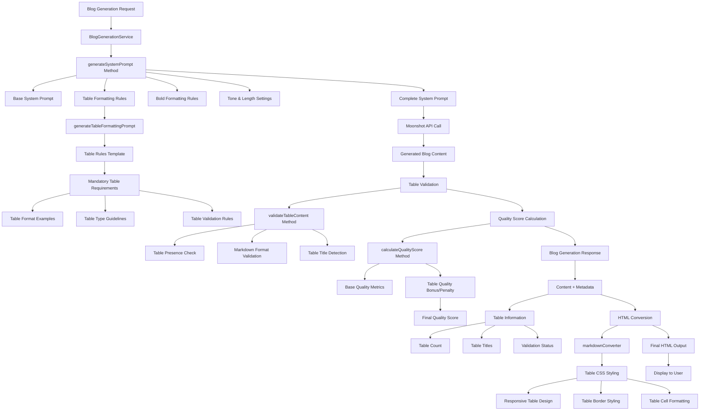

# Table Generation Architecture Diagram

## System Flow with Table Integration



## Component Integration Details

### 1. System Prompt Generation
- **Base Prompt**: Core AI personality and safety guidelines
- **Table Rules**: Mandatory table generation requirements
- **Formatting Rules**: Bold text and other formatting preferences
- **Content Guidelines**: Tone, length, and audience specifications

### 2. Table Validation Pipeline
- **Presence Check**: Ensures at least one table exists
- **Format Validation**: Verifies proper Markdown table syntax
- **Structure Analysis**: Checks column/row limits and content length
- **Title Detection**: Validates table titles exist and are properly formatted

### 3. Quality Scoring Enhancement
- **Base Score**: Existing content quality metrics
- **Table Bonus**: Points for proper table inclusion
- **Table Penalty**: Deductions for missing or poorly formatted tables
- **Final Score**: Combined quality assessment

### 4. HTML Conversion Pipeline
- **Markdown Parsing**: Converts Markdown to HTML
- **Table Styling**: Applies CSS classes for responsive design
- **Content Enhancement**: Ensures proper rendering across devices

## Data Flow

### Input: BlogGenerationRequest
```typescript
{
  topic: "Productivity Tips",
  model: "kimi-k2",
  options: {
    tone: "conversational",
    length: "medium",
    includeExamples: true
  }
}
```

### System Prompt Components
```typescript
const systemPrompt = `
  ${basePrompt}
  ${generateTableFormattingPrompt()}  // NEW: Table rules
  ${generateBoldFormattingPrompt()}    // Existing: Bold rules
  ${toneInstructions}                // Existing: Tone settings
  ${lengthRequirements}               // Existing: Length settings
`;
```

### Table Validation Output
```typescript
{
  hasTables: true,
  tableCount: 1,
  isValidMarkdown: true,
  tableTitles: ["Productivity Tools Comparison"]
}
```

### Enhanced Quality Score
```typescript
{
  baseScore: 85,
  tableBonus: 10,
  finalScore: 95,
  tableInfo: {
    hasTables: true,
    isValidMarkdown: true,
    tableCount: 1
  }
}
```

### Final Response Structure
```typescript
{
  content: "<html>...</html>",
  metadata: {
    model: "kimi-k2",
    tokensUsed: 1500,
    processingTime: 3200,
    qualityScore: 95,
    tableInfo: {           // NEW: Table metadata
      hasTables: true,
      tableCount: 1,
      isValidMarkdown: true,
      tableTitles: ["Productivity Tools Comparison"]
    }
  }
}
```

## Benefits of This Architecture

1. **Modular Design**: Table functionality is encapsulated in separate methods
2. **Non-Breaking**: Existing functionality remains unchanged
3. **Scalable**: Easy to add new table types or validation rules
4. **Testable**: Each component can be tested independently
5. **Maintainable**: Clear separation of concerns

## Integration Points

### New Methods Added
- `generateTableFormattingPrompt()`: Creates table-specific prompt rules
- `validateTableContent()`: Validates table presence and formatting
- Enhanced `calculateQualityScore()`: Includes table quality assessment

### Modified Methods
- `generateSystemPrompt()`: Now includes table formatting rules
- `generateWithKimiK2()`: Returns table validation metadata
- `calculateQualityScore()`: Enhanced with table quality metrics

### Existing Components Leveraged
- `markdownConverter.ts`: Already handles table HTML conversion and styling
- Quality scoring framework: Extended to include table metrics
- Response structure: Enhanced with table information metadata

This architecture ensures seamless integration of table generation while maintaining the existing system's reliability and performance.